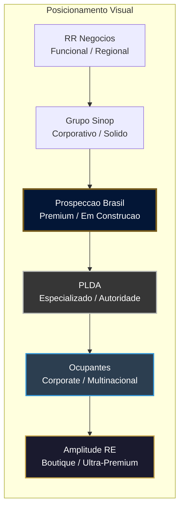

# Auditoria de Design -- Prospeccao Brasil

**Data:** 31/07/2026
**Escopo:** Site institucional publico + Sistema interno administrativo
**Referencia:** PLDA, RR Negocios, Ocupantes, Amplitude RE, Grupo Sinop

---

## Resumo Executivo

O Prospeccao Brasil ja possui uma **base solida** com fundamentos bem estruturados: design system tokenizado, tipografia profissional (Montserrat/Inter), paleta corporativa coerente (Navy + Gold), componentes premium (glass nav, Ken Burns hero, scroll reveal), e 35 templates cobrindo todo o fluxo do negocio. **O projeto NAO esta brega** -- esta acima da media do mercado em termos de acabamento tecnico.

Porem, ao comparar com os 5 sites de referencia (especialmente PLDA e Ocupantes, que sao os mais proximos do posicionamento de voces), existem **lacunas de consistencia, conteudo e maturidade visual** que impedem o site de transmitir a autoridade institucional que o mercado exige.

---

## Veredicto por Area

| Area | Nota | Status |
|:-----|:----:|:------:|
| Paleta de cores e tokens | 8/10 | Boa base, precisa unificar |
| Tipografia | 7/10 | Boa escolha, inconsistencia de escala |
| Navegacao publica | 8/10 | Glass nav premium, faltam itens |
| Hero / primeira impressao | 7/10 | Impactante, mas generico vs. mercado |
| Conteudo institucional | 5/10 | Falta profundidade e autoridade |
| Social proof / credibilidade | 4/10 | Ponto mais fraco |
| Footer | 7/10 | Funcional, faltam elementos-chave |
| Sistema admin | 7/10 | Funcional, visual frio e desconectado |
| Consistencia design system | 5/10 | Principal problema tecnico |
| Responsividade | 8/10 | Bem implementada |

**Nota global: 6.6/10** -- Profissional o suficiente para operar, mas nao transmite a autoridade que PLDA/Ocupantes/Amplitude projetam.

---

## 1. O Que Esta Funcionando Bem

### Acertos que devem ser mantidos

- **Glass nav flutuante** (`.glass-nav`) com backdrop blur -- padrao premium que nenhum dos 5 concorrentes tem. PLDA usa Wix padrao, RR Negocios usa navbar convencional. Voces estao **acima** nesse ponto.
- **Paleta Navy (#031636) + Gold (#765a1a)** -- transmite seriedade e sofisticacao. A combinacao remete a private banking/boutique de investimentos. Amplitude RE e o unico concorrente com posicionamento visual similar.
- **Ken Burns hero** com overlay gradiente -- efeito cinematografico que nenhum dos 5 concorrentes usa. Vantagem.
- **Tipografia Montserrat + Inter** -- escolha correta, alinhada com Ocupantes (Open Sans) e Grupo Sinop (Inter/Rubik). Montserrat pra headlines e mais impactante.
- **HTMX + Alpine.js** -- stack tecnico maduro que permite interatividade server-rendered sem SPA. Nenhum concorrente faz isso (todos usam WordPress ou Wix).
- **Scroll reveal animations** (`.reveal` com IntersectionObserver) -- micro-interacao sutil que adiciona dinamismo profissional.
- **WhatsApp flutuante** -- presente em TODOS os 5 concorrentes. Padrao obrigatorio no mercado brasileiro, ja implementado.
- **Site gate** (area restrita) -- diferencial unico que nenhum concorrente tem. Transmite exclusividade.

---

## 2. Problemas Criticos de Consistencia

### 2.1 Design System Fragmentado (Warm vs. Cool)

> [!WARNING]
> Este e o problema tecnico mais grave. O design system opera com **duas linguagens visuais incompativeis**.

| Aspecto | Site Publico | Sistema Admin |
|:--------|:------------|:-------------|
| Background | Warm beige `#fcf9f8` | Cool slate `bg-slate-50` |
| Bordas | Gold/navy sombras | `border-slate-200` |
| Botoes | Pill `rounded-full` | Box `rounded-md` |
| Inputs | Bottom-border premium | Full-border box |
| Cor accent | Gold `#765a1a` | Sem accent definido |

**Nenhum dos 5 concorrentes** tem esse problema porque nenhum deles expoe o admin como produto visual. Mas se voces pretendem que o sistema interno tambem transmita profissionalismo (e devem -- o Luiz Claudio usa diariamente), **o admin precisa compartilhar a mesma linguagem visual do site publico**.

**Referencia ideal:** Veja como o RR Negocios usa exatamente a mesma paleta verde (`#007f5e`) tanto no site publico quanto no painel de listagens.

### 2.2 Valores Hardcoded vs. Tokens

```
Problema encontrado em multiplos templates:
```

- Templates publicos usam `style="color: #d4af6a;"` e `style="background: linear-gradient(135deg, #765a1a, #d4af6a);"` inline em vez dos tokens do Tailwind.
- `input.css` repete hex codes hardcoded (`#765a1a`, `#031636`, `#25d366`, `#cbd5e1`) em vez de usar `theme()` ou `@apply`.
- Hero headlines usam `text-5xl md:text-6xl lg:text-7xl font-extrabold` (72px+) ignorando o token `display-lg: 48px` definido no Tailwind config.
- Fragment `contact_error.html` renderiza `.card` + `.form-input` (box border) quando o form original usa `.form-glass` + `.form-input-premium` (bottom border) -- **quebra visual apos erro**.

### 2.3 Nomenclatura de Componentes Inconsistente

| Componente | Classe publica | Classe admin | Padrao ideal |
|:-----------|:--------------|:-------------|:-------------|
| Card | `.premium-card` | `.card` | Deveria ser um unico componente com variantes |
| Botao | `.btn-pill`, `.btn-primary` | `.btn-filled`, `.btn-tonal`, `.btn-ghost` | Material Design naming e bom, mas deveria valer pro publico tambem |
| Input | `.form-input-premium` | `.form-input` | Um unico `.input` com variante premium |
| Badge | `.eyebrow` | `.badge-*` | Correto manter separados, mas `.eyebrow` deveria usar token |

---

## 3. Lacunas vs. Concorrentes (O Que Falta)

### 3.1 Conteudo e Autoridade Institucional

Comparando a estrutura de conteudo do Prospeccao Brasil com os 5 concorrentes:

| Elemento | PB | PLDA | RR | Ocupantes | Amplitude | Sinop |
|:---------|:--:|:----:|:--:|:---------:|:---------:|:-----:|
| Hero com proposta direta | Parcial | Sim | Sim | Sim | Sim | Sim |
| Segmentacao por publico | Nao | Sim | Sim | Sim | Sim | Sim |
| Vocabulario tecnico B2B | Parcial | Forte | Medio | Forte | Forte | Medio |
| Pagina de equipe | Nao | Sim | Nao | Sim | Nao | Nao |
| Blog / conteudo | Nao | Nao | Nao | Sim | Nao | Sim |
| Pagina LGPD / Privacidade | Nao | Nao | Nao | Nao | Sim | Sim |
| Seletor de idioma PT/EN | Nao | Nao | Nao | Sim | Nao | Nao |
| "10 razoes para contratar" | Nao | Nao | Nao | Sim | Nao | Nao |
| Depoimentos com nome/cargo | Sim | Sim | Nao | Nao | Nao | Nao |
| Logos de clientes (grid) | Nao | Sim | Nao | Nao | Nao | Sim |
| Numero CRECI no footer | Sim | Sim | Sim | Nao | Nao | Nao |
| Endereco fisico destaque | Nao | Sim | Sim | Sim | Nao | Nao |
| Portal para corretores/parceiros | Nao | Nao | Nao | Nao | Nao | Sim |
| Ferramenta proprietaria | Nao | Nao | Sim | Sim | Nao | Nao |

### 3.2 Hero Section -- Proposta de Valor Direta

**O que os concorrentes fazem (e funciona):**
- PLDA: *"Alugamos seu imovel para grandes redes varejistas."* -- direto, claro, especifico.
- Ocupantes: *"Corporate Real Estate -- Tenant Representation."* -- posicionamento tecnico.
- Grupo Sinop: *"Focado em transformar cidades."* -- aspiracional mas concreto.

**O que o Prospeccao Brasil deveria comunicar:**
Uma frase que responda: "O que voce faz e para quem?" em 10 palavras ou menos. Exemplos:
- *"Pontos comerciais para redes que precisam expandir."*
- *"Inteligencia comercial para varejistas e investidores."*
- *"Conectamos redes varejistas aos melhores pontos do Brasil."*

### 3.3 Segmentacao de Navegacao por Publico

**PLDA faz isso magistralmente** com 4 menus tematicos:
1. Servicos (por tipo de operacao)
2. Segmentos (por vertical de mercado)
3. Investidores e Family Offices
4. Quem Faz a PLDA

**O Prospeccao Brasil tem:**
- Home, Quem Somos, Servicos, Nossos Clientes, Fale Conosco

Isso e uma navegacao **generica** que poderia pertencer a qualquer empresa de qualquer setor. Falta a segmentacao por stakeholder que define autoridade no mercado imobiliario corporativo.

### 3.4 Barra de Contato Superior (Top Contact Bar)

**Presente em:** RR Negocios, Ocupantes
**Ausente no Prospeccao Brasil.**

Uma barra fina acima da nav com telefone, email, CRECI e redes sociais e padrao do setor. Transmite acessibilidade e legitimidade imediata.

---

## 4. Analise do Sistema Interno (Admin)

### O que funciona
- CRUD completo de imoveis, clientes e prospeccoes
- Pipeline de status com badges coloridos
- Geracao de PDF via chromedp
- Registro de contatos inline
- Filtros funcionais com HTMX

### O que precisa melhorar

1. **Visual desconectado do publico** -- a sidebar navy e o unico elemento que conecta admin ao brand. O restante e um sistema generico em cinza slate que poderia ser qualquer SaaS.

2. **Dashboard sem impacto visual** -- KPI cards simples sem graficos, tendencias ou indicadores visuais. Comparado ao que o Luiz Claudio veria em um CRM moderno, esta basico.

3. **Tabelas de dados sem refinamento** -- overflow horizontal funciona, mas falta: ordenacao visual, zebra striping, hover states nas rows, acoes rapidas inline.

4. **Empty states genericos** -- quando nao ha dados, a experiencia e fria. Deveria ter ilustracoes e guidance contextual.

5. **Formularios longos sem secoes** -- o form de imovel mistura endereco, financeiro e descricao em um bloco unico. Deveria ter secoes visuais (fieldsets com headers).

---

## 5. Plano de Acao Priorizado

### Prioridade 1: Consistencia do Design System (Fundacao)

| # | Acao | Impacto |
|:-:|:-----|:--------|
| 1 | Eliminar TODOS os `style="..."` inline nos templates, migrar para classes Tailwind ou custom utilities em `input.css` | Manutenibilidade |
| 2 | Alinhar escala tipografica: hero usa `display-lg` token (48px), nao `text-7xl` hardcoded (72px) -- ou atualizar o token | Consistencia |
| 3 | Unificar componentes: um `.card` com variantes `card--premium`, `card--admin`, `card--glass` em vez de 3 classes separadas | DRY |
| 4 | Unificar botoes: `.btn` base com modificadores `.btn--pill`, `.btn--filled`, `.btn--tonal`, `.btn--ghost` | Consistencia |
| 5 | Unificar inputs: `.input` base com `.input--premium` (bottom border) e `.input--bordered` (full border) | Consistencia |
| 6 | Corrigir `contact_error.html` para manter `.form-glass` + `.form-input-premium` | Bug visual |
| 7 | Migrar hex hardcoded em `input.css` para `theme()` references | Manutenibilidade |

### Prioridade 2: Conteudo e Autoridade (Site Publico)

| # | Acao | Referencia |
|:-:|:-----|:----------|
| 8 | Reescrever hero headline com proposta de valor direta e especifica | PLDA |
| 9 | Adicionar top contact bar (telefone, email, CRECI, redes sociais) | RR Negocios |
| 10 | Reestruturar navegacao com segmentacao por stakeholder: Servicos > Investidores > Varejistas > Sobre | PLDA |
| 11 | Adicionar grid de logos de clientes/marcas atendidas | PLDA, Sinop |
| 12 | Criar secao "Por que nos contratar?" com diferenciais numerados | Ocupantes |
| 13 | Adicionar endereco fisico em destaque (nao so no footer) | PLDA, RR, Ocupantes |
| 14 | Criar pagina de Politica de Privacidade / LGPD | Sinop, Amplitude |
| 15 | Enriquecer vocabulario tecnico: BTS, SLB, lajes corporativas, contratos atipicos | PLDA, Ocupantes |

### Prioridade 3: Sistema Interno (Admin)

| # | Acao | Impacto |
|:-:|:-----|:--------|
| 16 | Aplicar tokens warm surface do publico no admin (mesmo `#fcf9f8` ou versao mais sutil) | Coesao de marca |
| 17 | Adicionar gold accent nos CTAs do admin (`.btn-filled` com gold hover) | Identidade |
| 18 | Melhorar dashboard com mini-graficos sparkline e indicadores visuais de tendencia | Usabilidade |
| 19 | Adicionar zebra striping + hover rows + acoes rapidas inline nas tabelas | Usabilidade |
| 20 | Separar formularios longos em fieldsets com headers visuais | UX |
| 21 | Criar empty states com ilustracoes e orientacao contextual | UX |

### Prioridade 4: Polish e Diferenciacao

| # | Acao | Referencia |
|:-:|:-----|:----------|
| 22 | Adicionar animacoes de entrada nos KPI cards do dashboard | Amplitude |
| 23 | Implementar dark mode toggle no admin (otimizar para uso prolongado) | Diferencial |
| 24 | Criar transicoes de pagina suaves (View Transitions API) | Diferencial |
| 25 | Adicionar micro-interacoes nos status badges (pulse em "new", etc.) | Diferencial |

---

## 6. Comparacao Visual com Concorrentes



**O Prospeccao Brasil esta entre Grupo Sinop e PLDA** em termos de posicionamento visual. A base tecnica e superior a maioria (Go+HTMX vs. WordPress/Wix), mas o conteudo e a consistencia visual ainda nao comunicam a autoridade necessaria.

---

## 7. Conclusao

O site **NAO e brega**. A paleta, tipografia e componentes premium (glass nav, Ken Burns, scroll reveal) estao acima da media do mercado. O problema principal e:

1. **Consistencia** -- dois mundos visuais (warm publico vs. cool admin) que nao conversam
2. **Conteudo** -- falta a profundidade institucional que PLDA e Ocupantes demonstram
3. **Social proof** -- nao ha logos de clientes, cases, numeros de mercado impactantes
4. **Segmentacao** -- navegacao generica que nao fala diretamente com investidores, varejistas ou proprietarios

O caminho nao e redesenhar do zero. E **consolidar o design system, enriquecer o conteudo, e alinhar o admin com a identidade da marca**. As 25 acoes acima, executadas na ordem de prioridade, transformam o Prospeccao Brasil de "profissional em construcao" para "autoridade do setor".
